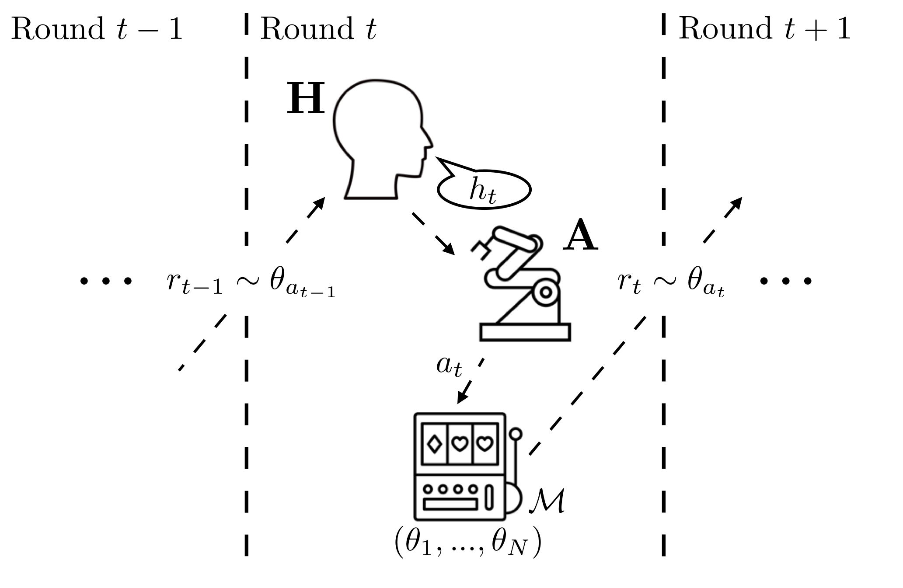

# Assistive Bandits
Environment and solver code for The Assistive Multi-Armed Bandit (2019).

## Why assistive bandits?


## Installation 

### Requires
```
gym (0.9.x)
numpy
scipy
rllab
tensorflow 1.2+
sklearn
pyprind
```
### (Recommended) Installing using install script
We recommend that you set up an isolated environment to install and run this code in, as it depends on an older version of `gym`.

First, setup your virtual environment. install `tensorflow` or `tensorflow-gpu`. Then, run:
```
chmod u+x install.sh
./install.sh
```

## Usage

### Reproducing MAB results
To reproduce our results from The Assistive MAB paper, run
```
python assistive-bandits/experiments/mab-experiments.py 
```
By default, our code will sequentially train an agent against every human policy included in the paper, and then test this policy against every human policy. This takes a significant amount of time (about 2-3 hours per policy per seed on an AWS p3.2xlarge). 

#### Evaluating trained policies
To evaluate a trained assistive policy, run:
`python assistive-bandits/experiments/evaluate_policy.py <path to policy file>`
